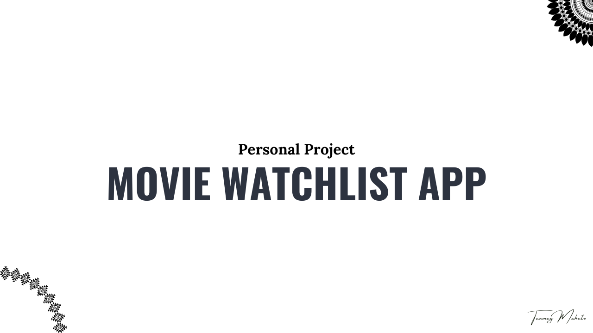

# Movie Watchlist CRUD App

A movie watchlist **CRUD app** built with **Golang** and it's standard library along with basic HTML, CSS, Bootstrap and little bit help of HTMX at the Frontend.
> **Project demo video** - [](https://www.youtube.com/watch?v=cl4dCQGujK8)

## Features

- **Create**- Add movies to the watchlist
- **Read**- View and filter movies in the wishlist
- **Update**- Edit movies in the watchlist
- **Delete**- Mark movies as watched, which removes them from the watchlist and adds them to the watched list
  
## Setup Instructions

### Prerequisites

- **MySQL server** installed and running
- **MySQL client** installed
- **Golang** installed (version 1.16 or higher)
  
### Step 1: Clone the Repository

```sh
git clone https://github.com/TanmayMahato/movie_watchlist_app.git
cd movie_watchlist_app
```

### Step 2: Create the Database and Tables

- Open your **MySQL client** or **Terminal**.
- Run the provided SQL script to create the database and tables.

```sh
 mysql -u your-username -p < setup.sql
 ```

- Enter your **MySQL password** when prompted.

### Step 3: Update the Configuration

- Update the **setup.env** file with your database credentials.
Edit the **setup.env** file with the following content:

```env
DB_HOST="localhost"
DB_PORT="3306"
DB_USER= "*"                          # MySql UserName in place of * ---> example = "root"
DB_PASSWORD= "*"                      # MySql Password in place of *                     #MySql Password
```  

### Step 4: Run the Application

Start the application :  

```sh
cd cmd/app/main.go

go run main.go
```

##### The app will be running on localhost port - 8080. Go check it out

###### *Note - Alter the commands according to your system by referencing the internet, the application is only tested running on Ubuntu 24.04lts and Ubuntu 22.04lts*
